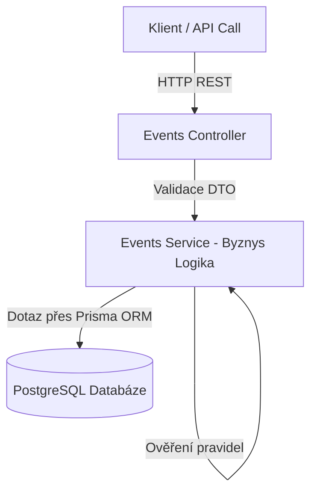

# Správa rezervací událostí (Event Booking API)
Semestrální projekt spojující metodiku **TDD/BDD** s kompletním **DevOps workflow**. Aplikace poskytuje REST API pro správu událostí a registraci uživatelů.

---

## 1. Doména a Byznys pravidla (TDD)
Aplikace obsahuje 3 hlavní entity: `User`, `Event` a `Registration` (vazba N:M).

**Implementovaná byznys pravidla (ošetřeno v byznys vrstvě):**
1. **Kapacita:** Nelze překročit maximální kapacitu události.
2. **Duplicita:** Jeden uživatel se nemůže na stejnou událost přihlásit dvakrát (idempotence).
3. **Věkové omezení:** Na akce s příznakem `isAdultOnly` se smí přihlásit pouze uživatelé starší 18 let.
4. **Deadline:** Registrace je možná nejpozději 24 hodin před začátkem události.
5. **Storno:** Zrušit registraci lze nejpozději 24 hodin před začátkem, jinak propadá.

---

## 2. Architektura a Technologie
* **Aplikace:** NestJS (Node.js framework), TypeScript
* **Architektura:** Třívrstvá (Controller -> Service -> Data Access/Prisma)
* **Databáze:** PostgreSQL (spravováno přes Prisma ORM)
* **Validace:** Globální DTO validace (ValidationPipe), striktní error handling.
* **Kontejnerizace:** Docker (Multi-stage build)
* **Orchestrace:** Kubernetes (K8s)

**Diagram komponent a datových toků:**

---

## 3. Testovací strategie a TDD
Projekt byl vyvíjen striktně metodikou **Test-Driven Development (TDD)** (cyklus Red-Green-Refactor je viditelný v historii gitu).
* **Unit testy (Jest):** Pokrývají doménovou logiku v `EventsService`. Psány podle principů **FIRST** a strukturovány vzorem **AAA (Arrange, Act, Assert)**. K izolaci od databáze je použit `jest-mock-extended` (mockování vrstvy Prisma).
* **Integrační (E2E) testy (Supertest):** Testují reálné HTTP požadavky přes `EventsController` na aplikační logiku včetně validací DTO.
* **Statická analýza:** Kód podléhá kontrole pomocí nástroje ESLint.
* **Code Coverage:** Udržována nad 70 % (Lines) pro doménovou vrstvu. Report je generován automaticky v CI pipeline jako artefakt. Vynechány jsou pouze konfigurační moduly frameworku (main.ts, moduly), které neobsahují byznys logiku.

---

## 4. DevOps, CI/CD a Prostředí
Projekt využívá plně automatizovanou CI/CD pipeline na GitHub Actions.

**CI Pipeline obsahuje kroky:**
1. Stažení kódu a instalace závislostí s NPM cache.
2. Spuštění statické analýzy a linteru.
3. Spuštění Unit testů + měření pokrytí (uložení reportu jako artefakt).
4. Spuštění E2E integračních testů.
5. Sestavení Docker image a jeho publikace jako artefaktu.

**Kontejnerizace (Docker):**
* Využit **Multi-stage build** pro minimalizaci velikosti image.
* Z bezpečnostních důvodů (Best Practice) běží produkční kontejner pod ne-root uživatelem (`USER node`).

**CD a Kubernetes (K8s):**
Zvoleno oddělení prostředí přes **Kubernetes Namespaces**.
* **Staging:** `kubectl create namespace staging`
* **Production:** `kubectl create namespace production`

Automatizované nasazení (CD) do `staging` probíhá přímo v pipeline pomocí dočasného clusteru (nástroj Kind). Pro produkci se používá stejná sada manifestů, liší se pouze injektovaný `Secret`.

**Struktura manifestů (`/k8s`):**
* `db.yaml` a `api.yaml`: Definice Deploymentů a Services. API obsahuje definované limity na CPU a RAM.
* `configmap.yaml`: Veřejná necitlivá konfigurace.
* `secret-template.yaml`: Ukázka struktury tajných údajů. Skutečná hesla nejsou uložena v gitu v plaintextu.

---

## 5. Jak spustit projekt lokálně

### Varianta A: Kompletní spuštění v Dockeru (Doporučeno)
Tento příkaz sestaví aplikaci a nastartuje ji i s PostgreSQL databází:
```bash
docker compose up --build